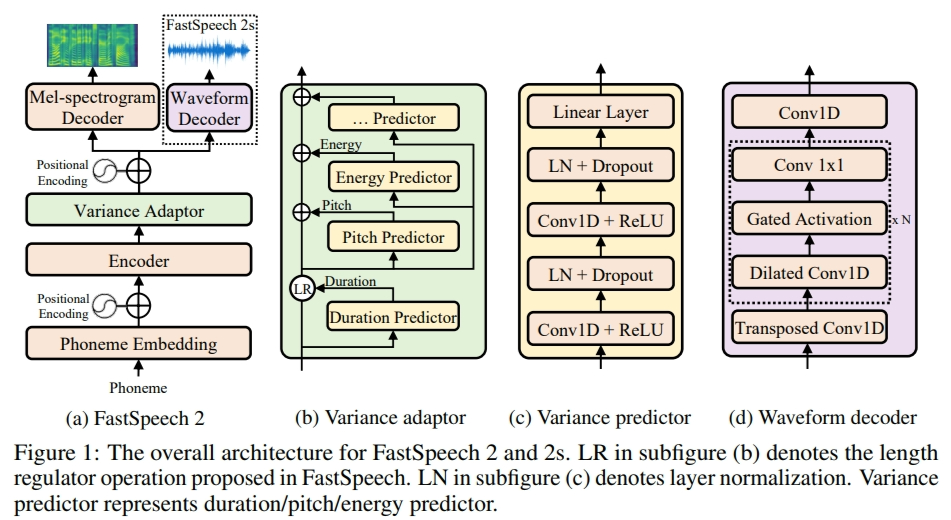
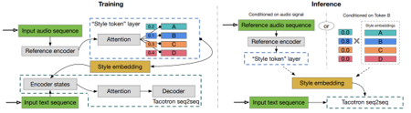
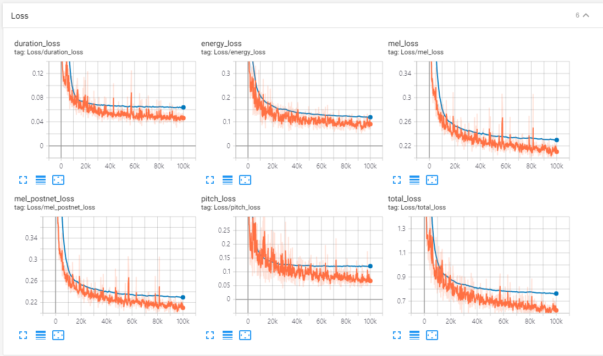
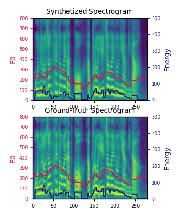

# Korean FastSpeech 2 with GST - PyTorch Implementation
This is project has only vanilla FastSpeech2 and GST. You should combine GST and FastSpeech2.






## Requirements
Python >= 3.7
PyTorch >= 1.7.1
librosa >= 0.8.0
g2pk

# Training


## Datasets
Korea Single Speaker Speech (KSS) Dataset [https://www.kaggle.com/bryanpark/korean-single-speaker-speech-dataset](https://www.kaggle.com/bryanpark/korean-single-speaker-speech-dataset)

Kaist Audiobook Dataset [https://aihub.or.kr/opendata/kaist-audiobook](https://aihub.or.kr/opendata/kaist-audiobook)


## Preprocessing
 
First, run 
```
python3 prepare_align.py
```
for some preparations.

As described in the paper, [Montreal Forced Aligner](https://montreal-forced-aligner.readthedocs.io/en/latest/) (MFA) is used to obtain the alignments between the utterances and the phoneme sequences.

and Train mfa

```
mfa train wav_path dictionary_path output_path –c
```


After that, run the preprocessing script by
```
python3 preprocess.py
```

## Training

Train your model with
```
python3 train.py
```

# TensorBoard

Use
```
tensorboard --logdir output/log/
```






# References
- [FastSpeech 2: Fast and High-Quality End-to-End Text to Speech](https://arxiv.org/abs/2006.04558), Y. Ren, *et al*.
- [Style Tokens: Unsupervised Style Modeling, Control and Transfer in End-to-End Speech Synthesis](https://arxiv.org/abs/1803.09017), Y. Wang, *et al*.

- [ming024's FastSpeech implementation](https://github.com/ming024/FastSpeech2)
- [KinglittleQ's GST-Tacotron implementation](https://github.com/KinglittleQ/GST-Tacotron)
